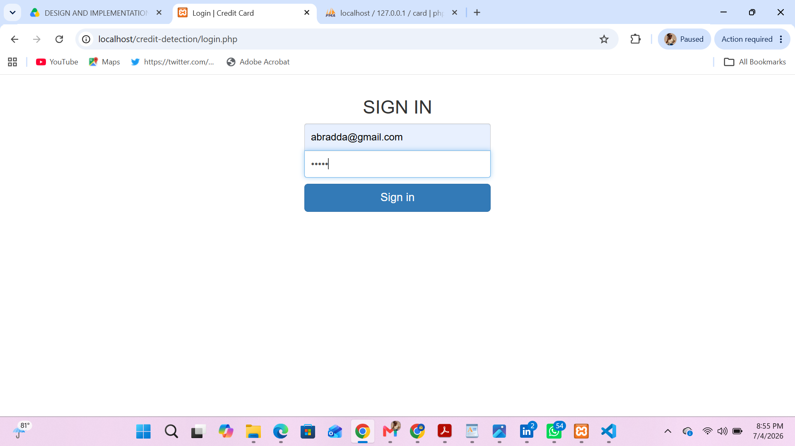
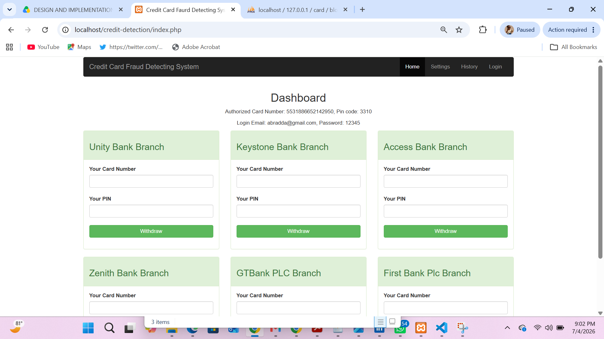
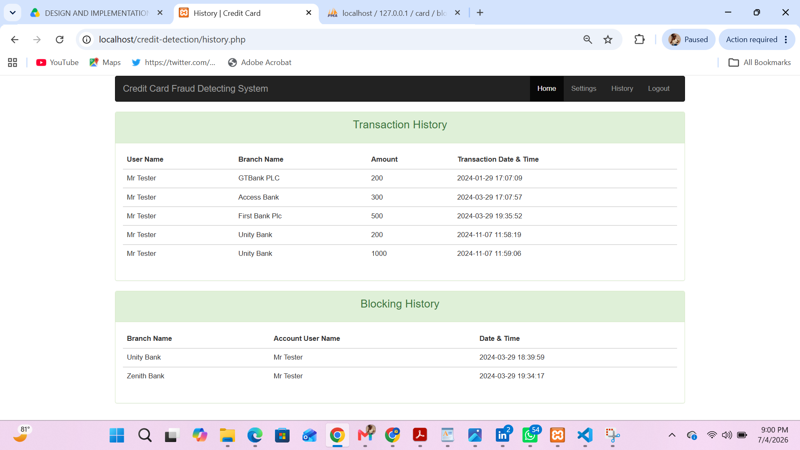
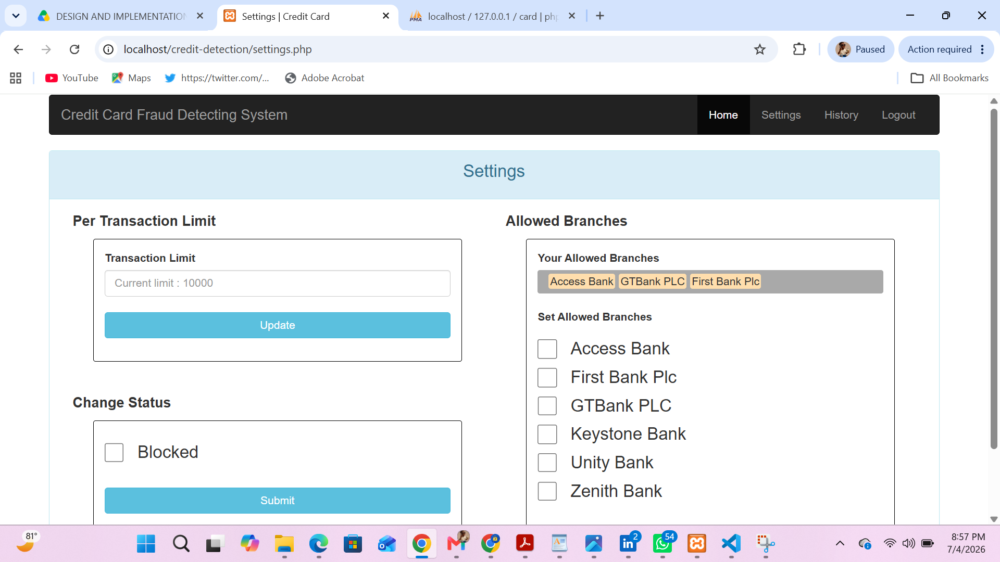

────────────────────────────────────────────
     CREDIT CARD FRAUD DETECTION SYSTEM
        Undergraduate Final Year Project
────────────────────────────────────────────
#  Credit Card Fraud Detection System

> **Undergraduate Final Year Project (B.Sc. Computer Science & Information Technology)**


##  Overview

This repository contains my undergraduate final-year project titled **Credit Card Fraud Detection System**.

The project was developed to demonstrate how software can help identify suspicious credit card transactions, improve transaction monitoring, and reduce fraudulent activities through rule-based verification and transaction analysis.

Although this project reflects my academic work at the time, it represents an important milestone in my software engineering journey.

---

##  Features

* User authentication
* Credit card transaction processing
* Transaction history
* Fraud detection workflow
* Card management
* System settings
* MySQL database integration
* Bootstrap-based user interface

---

##  Technologies Used

* PHP
* MySQL
* HTML5
* CSS3
* JavaScript
* Bootstrap
* jQuery

---

##  Project Structure

```text
credit-card-fraud-detection-system/
│
├── assets/
│   ├── BS/
│   │   ├── css/
│   │   ├── fonts/
│   │   └── js/
│   ├── css/
│   └── JS/
│
├── helper/
│   ├── config.php
│   ├── clear_transaction.php
│   ├── logout.php
│   └── navbar.html
│
├── screenshots/
│   ├── login.png
│   ├── dashboard.png
│   ├── transaction.png
│   └── settings.png
│
├── dashboard.php
├── history.php
├── index.php
├── login.php
├── settings.php
├── transaction.php
├── card.sql
├── .gitignore
├── LICENSE
└── README.md
```
## Demo

> This project currently runs locally using XAMPP.

Future deployment is planned as part of the modern FraudShield AI platform.
##  Project Status

 Completed (Academic Version)

 Modern successor currently in development:

##  Installation

### Requirements

* XAMPP (Apache & MySQL)
* PHP
* Web Browser

### Steps

1. Clone this repository.

```bash
git clone https://github.com/cYBerLson/credit-card-fraud-detection-system.git
```

2. Move the project into the `htdocs` directory.

3. Start **Apache** and **MySQL** using XAMPP.

4. Create a MySQL database named:

```text
card
```

5. Import the included `card.sql` file.

6. Open your browser and visit:

```text
http://localhost/credit-card-fraud-detection-system/
```

---

##  Screenshots

### Login Page


### Dashboard


### Transaction & History


### Settings


---

##  Academic Project

This repository preserves my undergraduate final-year project.

It showcases my early experience with PHP, MySQL, database design, and fraud detection concepts.

Since completing this project, I have expanded my expertise in cybersecurity, secure software development, and AI-powered security solutions.

---

##  Future Improvements

Planned improvements include:

* AI-powered fraud detection
* Machine learning integration
* Modern dashboard
* REST API
* Role-based access control
* Docker deployment
* Secure authentication
* Real-time fraud monitoring

A modern successor to this project is currently planned using Python, Flask/FastAPI, machine learning, and modern cybersecurity best practices.

---
##  Skills Demonstrated

- PHP Development
- MySQL Database Design
- SQL Queries
- Authentication
- Transaction Processing
- Fraud Detection Concepts
- Bootstrap UI

##  Author

**Abdulmajid Bello**

Cybersecurity Enthusiast | Ethical Hacker | Penetration Tester | Software Developer

GitHub: https://github.com/cYBerLson

---

##  License

This project is released under the MIT License.
